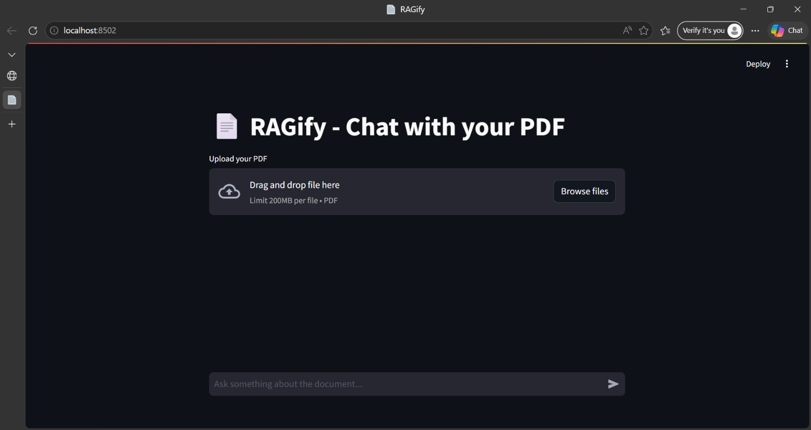
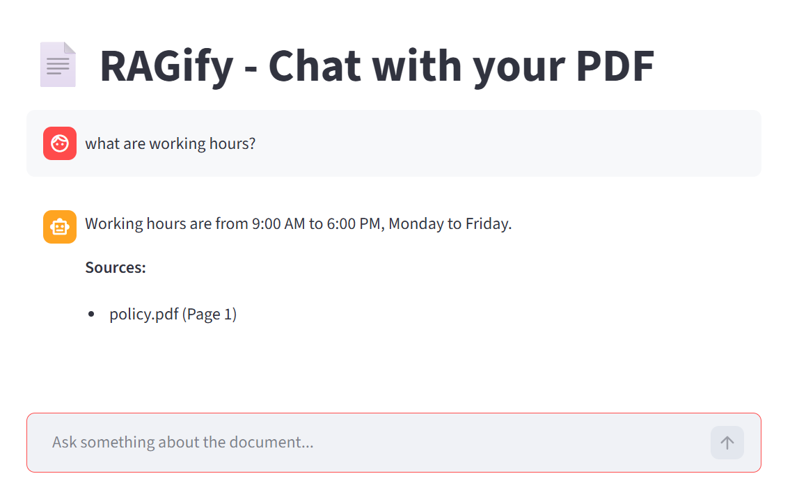

📄 RAG Document Assistant

A simple Retrieval-Augmented Generation (RAG) app to chat with PDFs using LangChain, FAISS, and local LLM.

---

🚀 Features

- Upload any PDF
- Ask questions about the document
- Shows source pages for answers
- Works locally using embeddings + FAISS

---

"
🧠 How It Works

Load  PDF document
Split into smaller chunks
Convert chunks into embeddings
Store embeddings in FAISS
Convert user query into embedding
Retrieve relevant chunks
Generate answer using LLM

🛠 Tech Stack

- Python
- Streamlit
- LangChain
- FAISS
- HuggingFace Embeddings
- Ollama (Mistral)

---

📂 Project Structure

app.py          # Streamlit UI
query.py        # Retrieval + LLM logic
ingest.py       # PDF processing (optional)
requirements.txt
README.md
---

⚙️ Setup Instructions

1. Clone repo

git clone <https://github.com/maheswarimanamasi/rag-document-assistant.git>
cd rag-document-assistant

2. Create virtual environment

python -m venv venv
venv\Scripts\activate

3. Install dependencies

pip install -r requirements.txt

4. Run ingestion

python ingest.py

5. Run app

streamlit run app.py

---

📌 Usage

1. Upload a PDF
2. Ask questions
3. Get answers with sources

---

⚠️ Notes

- Only answers from document context
- If not found → returns "Not found in document"

---

💡 Example Questions

- What is this document about?
- List key points
- Explain section 2

---

📸 Screenshots

## 📸 Screenshots

### 🖥️ Application UI

### 📄 Answer with Citations

## 🎥 Demo

⚠️ Limitations

- Works best with structured PDFs
- Not optimized for very large documents
- Accuracy depends on document quality